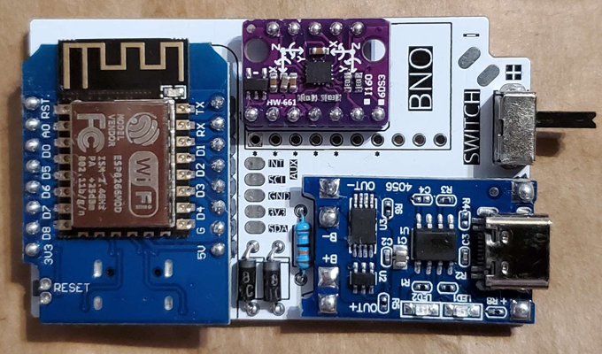
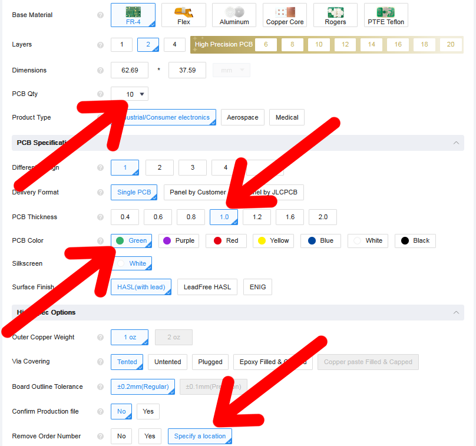
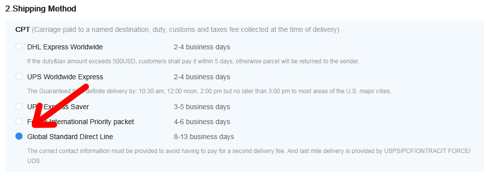
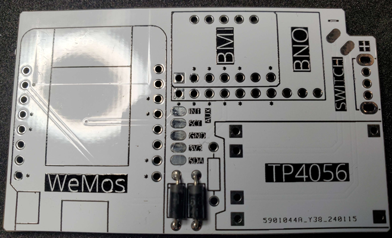
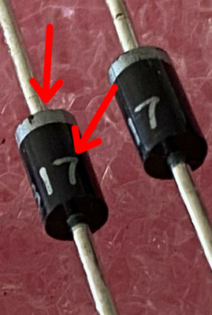
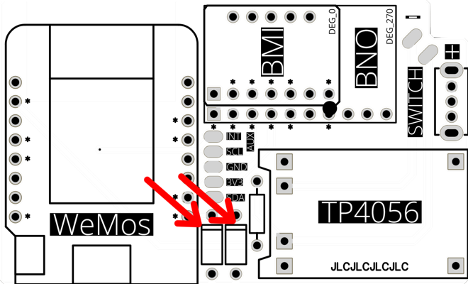
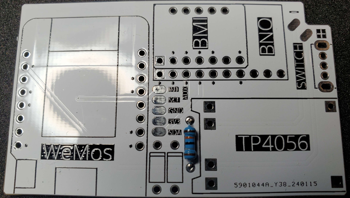

This guide is still a work in progress. It is a copy-pasta from my other repository and I am working my way through everything.

# meowCarrier
PCB, Case, and Accessories as do-it-yourself solution for SlimeVR Full Body Trackers. Ordering and Assembly instructions can be found in the README file.

## Purchasing Guide
### Recommended Components (PCB)
Choose either BNO085 (Performance), BMI270 (Value), or BMI160 (Budget) from the list below; not all three.

| Component | Variant | Link |
| -------------------- | --------------- | -------------------------------------------------------------------------------- |
| WeMos D1 Mini | Micro or Type-C (not V4.0.0) | <https://www.aliexpress.us/item/2251832465432818.html> |
| TP4056 | 18650 Micro or Type-C | <https://www.aliexpress.us/item/2251832290307200.html> |
| BMI160 | N/A | <https://www.aliexpress.us/item/2255799866368692.html> |
| BMI270 | N/A | <https://store.kouno.xyz/products/bmi270-breakout-board> |
| BNO085 | N/A | <https://shop.slimevr.dev/products/slimevr-imu-module-bno085> |
| SK12D07/SK12D07VG Switches | High 4mm | <https://www.aliexpress.us/item/3256804216279588.html> |
| 1/4W Metal Film Resistor | 180**K** | <https://www.aliexpress.us/item/3256803737288214.html> |
| Schottky Rectifier Diode | 1N5817 | <https://www.aliexpress.us/item/2255800018624086.html> |
| Header Pins | 2.54mm | <https://www.aliexpress.us/item/3256805804439042.html> |
| Lithium Polymer Ion Battery | 503759 without connector | <https://www.aliexpress.us/item/3256805125875396.html> |

> [!IMPORTANT]
> Purchase 30% more boards (WeMos D1 Mini, TP4056, and BMI160/BMI270/BNO085 than what is needed. There is the possibility that components are dead on arrival or get damaged during assembly/soldering.

> [!NOTE]
> One order of Resistors, Diodes, Header Pins, and Switches is enough for the entire project.

> [!NOTE]
> The SlimeVR DIY Community recommends buying boards from the following sellers on AliExpress: Win Win, Aitexm, or Tenstar Robot.

> [!NOTE]
> Type-C Ports are more durable. As for charging, USB-C to USB-C Power Delivery doesn't work. Use USB-A to USB-C cables to charge trackers.

> [!IMPORTANT]
> When purchasing components, some have multiple variants on the same product page like Diodes and Resistor. Be sure to select the correct one.

> [!TIP]
> In your AliExpress Cart, you can verify that you selected the correct variant of the component here.

### Optional Components (PCB)
| Component | Variant | Link |
| -------------------- | --------------- | -------------------------------------------------------------------------------- |
| Sheathed Wire Cable | 28AWG & 4Cores(BMI160 and BMI270)/5Cores(BNO085) | <https://www.aliexpress.us/item/2255800384086289.html> |

### Recommended Consumables/Tools
| Component | Variant | Link |
| -------------------- | --------------- | -------------------------------------------------------------------------------- |
| Soldering Iron | Any with BC2 Tip | <https://www.aliexpress.us/item/3256805553022893.html> |
| Solder Sucker| SS-02 or SS-02 Clone | <https://www.aliexpress.us/item/3256805437410900.html> |
| Desoldewring Iron| Choose your electrical outlet | <https://www.aliexpress.us/item/3256804929123151.html> |
| Rosin Flux | Liquid or Gel Type | N/A |

> [!NOTE]
> You will have a much better soldering experience with better tools. These are my recommended (but still on a budget) Soldering Iron and Solder Sucker if you don't have these tools or better already. They will work much better than those Amazon $10-20 soldering kits/iron.

> [!NOTE]
> The Soldering Iron listed requires an USB Type-C Power Delivery charging block of 60W or higher.

### Recommended Components (Case)
| Component | Variant | Link |
| -------------------- | --------------- | -------------------------------------------------------------------------------- |
| Trilancer Elastic Cinch Straps | See note below | <https://www.amazon.com/dp/B099RNRT7Z> |
| GoPro Chest Mount Harness | See note below | <https://www.aliexpress.us/item/3256805774922789.html> |
| GoPro Chest Mount Harness (Chesty) | Option B (with the thumb screw) | <https://www.aliexpress.us/item/2251832640172299.html> |

> [!NOTE]
> 12in works for ankles. 18in for thinner thighs and 24in for thicker thighs. Chest (if not using GoPro Chest Harness) and Hips can be done by doubling up on 18in/24in straps. Choose what you need for your body and how many trackers you are planning to make. 3 Size Combo and either 18in/24in package would be a start.

> [!NOTE]
> There are 2 types of GoPro Chest Mount Harness. One that clips in and the other one fasten by a bolt. Be sure to purchase one one for the case you are 3D Printing.

### Ordering PCBs from JLCPCB
1. Download the Gerber file from [here](https://github.com/Shine-Bright-Meow/meowCarrier/raw/main/PCB/PCB_meowCarrier.zip).
2. Go to [JLCPCB](https://jlcpcb.com).
3. Click on "Add Gerber File" and upload the zip Gerber file.

4. Select the PCB Qty and PCB Color of your choice. Select 1.0 for PCB Thickness and select "Specify a location" for Remove Order Number.

> [!IMPORTANT]
> Set PCB Thickness to 1.0 if you are using the case from this repository.

> [!NOTE]
> When ordering PCBs, please check if the case recommends a certain thickness it is designed for. For example, the case in this repository and Cheesecake recommend 1.0mm Thickness. If unspecified, the default 1.6mm will do. The case in this repository has loose tolerances incase you ordered the default 1.6mm thickness, it will work okay.

> [!NOTE]
> JLCPCB usually produces Green colored PCB the quickness. Other colors have additional days added.

> [!NOTE]
> For Remove Order Number, when "Specify a location" is selected, it will the order number will be printed at where the text **JLCJLCJLCJLC** is located. In this case, at the bottom of the TP4056 module footprint.
5. Click to View Cart.

6. Click Secure Checkout.

7. In the Shipping section, there are cheaper options not chosen by default.

## Soldering/Assembly Guide

### Written Guide

> [!WARNING]
> Please work at a well ventilated area. It is recommended to use a fume extractor if working indoors. If you do not have one, use a fan to blow fumes/smoke away from your face.

> [!WARNING]
> It is recommended to use eye production. Especially when splitting header pins apart with a cutter and when trimming down header pins and ends of resistors/diodes.

> [!WARNING]
> If working with leaded solder, be sure to wash your hands when you are done including under your fingernails. Wipe down and vacuum the floors and surfaces of your workspace and anything you may have cross-contaminated.

> [!TIP]
> Using external flux (preferably Rosin) will allow solder to flow to automatically flow into the correct area.

> [!TIP]
> A wooden clothespin can be used to hold the boards together while soldering.

> [!NOTE]
> Resistor and Diodes

##### Diodes

> [!NOTE]
> Make sure the diode is facing the correct direction and has the correct values.

1. Verify that the diodes are 1N5817. You can find the text on the body.

2. Place the diode's striped (grey/silver) on the narrow stripe indicated on the silkscreen.

3. Bend the ends in 90 degrees, so it is shaped like a staple and place into the through-hole.
4. Pull the excess on the back until diode is flush with the PCB.
5. Solder ends from the back.
6. Repeat for other diode.
7. Trim excess length of pins using a flush cutter. Use your wire cutter if you don't have a flush cutter and cut as close the the PCB as you can.

##### Resistor
> [!NOTE]
> Make sure the resistor is the correct value. It will not be easy to access the resistor once you solder the IMU above it.

1. Verify the resistor is 180K. The first 4 colors should go in this order:
- Brown
- Grey
- Black
- Orange

2. Bend the ends in 90 degrees, so it is shaped like a staple and place into the through-hole. Resistors are not polarized, so the direction does not matter.
3. Pull the excess on the back until resistor is flush with the PCB.
4. Trim excess length of pins using a flush cutter. Use your wire cutter if you don't have a flush cutter and cut as close the the PCB as you can.

#### Battery Connector
##### With JST PH 2.0mm 2P Connector

1. Place connector as positioned on the photo. The opening should be facing teh cutout and the smooth side should be on top and the slotted side should e against the PCB.
2. Solder the 2 pins in the back.
3. Trim excess length of pins using a flush cutter. Use your wire cutter if you don't have a flush cutter and cut as close the the PCB as you can.

> [!NOTE]
> If you got straight pin connectors, you can bend them 90 degrees, so they will work. There will be a little less pin length sticking out from the back to solder and there is a chance of you snapping them. You should have plenty of connectors incase the pin snaps.

##### Without JST Connector
> [!IMPORTANT]
> This step should be done last after the entire board is assembled and after you verified that the solder joints all look fine.

> [!IMPORTANT]
> Do not solder the battery leads to the holes of the PCB. The angle will put stress on the wire and solder joint and will eventually break off.

1. Strip the battery leads they are not exposed already.

> [!WARNING]
> Do not let the exposed battery leads make contact with each other.

2. Place your soldering iron on the BAT+ pad and melt the solder.
3. Place the **RED** battery lead in the molten solder pad and let it cool off.
4. Repeat the process for the BAT- pad and the **BLACK** battery lead.

#### Switch

##### DPDT 2P2T/SS22F32

##### SS12D00G3

#### Charging Board (TP4056)

#### IMU (BMI160, BMI270, or BNO085)

#### MCU (WeMos D1 Mini)

## Case Guide
The case consists of 3 files: Case, Lid, and Tray.

Printer Settings used:
- **Printer:** Creality CR-10 S5
- **Infill:** 0%
- **No** Rafts or Supports
- **Resolution:** 0.2mm
- **Nozzle:** 0.4mm
- Tested with PLA+ and PETG

> [!TIP]
> For stronger strap loops, print the base/bottom 4mm layers with 0% (solid) infill for just the **case** file. Printing with a zig-zap pattern instead of line will help prevent strap loops from breaking at the weak point where layers join horizontally or vertically. These are done in your Slicer.

### Case

> [!IMPORTANT]
> GoPro Chest Harness Tracker will have a different IMU rotation than your other trackers.

| Battery | Variant | AUX Cutout | Link |
| -------------------- | --------------- | -------------------------------------------------------------------------------- |
| 503759 | Main Case - 50mm Strap | No | [Hyperion_Lite_Case_503759.stl](https://github.com/Shine-Bright-Meow/SlimeVR-Hyperion-BMI-BNO-PCB-Case/raw/main/Case/STL/Hyperion_Lite_Case_503759.stl)|
| 503759 | Main Case - 50mm Strap | Yes | [Hyperion_Lite_Case_503759_AUX.stl](https://github.com/Shine-Bright-Meow/SlimeVR-Hyperion-BMI-BNO-PCB-Case/raw/main/Case/STL/Hyperion_Lite_Case_503759_AUX.stl) |
| 503759 | Main Case - GoPro Adapter1 | No | [Hyperion_Lite_Case_503759_AUX_Lupinixx.stl](https://github.com/Shine-Bright-Meow/SlimeVR-Hyperion-BMI-BNO-PCB-Case/raw/main/Case/STL/Hyperion_Lite_Case_503759_AUX_Lupinixx.stl) |
| 503759 | Main Case - GoPro Adapter1 | Yes | [Hyperion_Lite_Case_503759_GoPro.stl](https://github.com/Shine-Bright-Meow/SlimeVR-Hyperion-BMI-BNO-PCB-Case/raw/main/Case/STL/Hyperion_Lite_Case_503759_GoPro.stl) |
| 503759 | Main Case - GoPro Adapter2 | No | [Hyperion_Lite_Case_804040.stl](https://github.com/Shine-Bright-Meow/SlimeVR-Hyperion-BMI-BNO-PCB-Case/raw/main/Case/STL/Hyperion_Lite_Case_804040.stl)|
| 503759 | Main Case - GoPro Adapter2 | Yes | [Hyperion_Lite_Case_804040_AUX.stl](https://github.com/Shine-Bright-Meow/SlimeVR-Hyperion-BMI-BNO-PCB-Case/raw/main/Case/STL/Hyperion_Lite_Case_804040_AUX.stl) |
| N/A | AUX Case - BMI Breakout Board | No | [Hyperion_Lite_Case_804040_AUX_Lupinixx.stl](https://github.com/Shine-Bright-Meow/SlimeVR-Hyperion-BMI-BNO-PCB-Case/raw/main/Case/STL/Hyperion_Lite_Case_804040_AUX_Lupinixx.stl) |
| N/A | AUX Case - BNO Breakout Board | Yes | [Hyperion_Lite_Case_804040_GoPro.stl](https://github.com/Shine-Bright-Meow/SlimeVR-Hyperion-BMI-BNO-PCB-Case/raw/main/Case/STL/Hyperion_Lite_Case_804040_GoPro.stl) |

> [!IMPORTANT]
> Print Main Case with GoPro Adapter1 for the normal GoPro Chest Harness (Buckle).

> [!IMPORTANT]
> Print Main Case with GoPro Adapter2 for the "Chesty" GoPro Chest Harness or for the GoPro Headstrap (vTubing and Motion Capture).

### Lid
- AUX Variant has a 5mm hole for cable/wire for an extension tracker.
  
| Battery | Variant | Link |
| -------------------- | --------------- | -------------------------------------------------------------------------------- |
| 503759 | Main Case | [Hyperion_Lite_Lid_503759.stl](https://github.com/Shine-Bright-Meow/SlimeVR-Hyperion-BMI-BNO-PCB-Case/raw/main/Case/STL/Hyperion_Lite_Lid_503759.stl) |
| N/A | AUX Case | [Hyperion_Lite_Lid_503759_AUX.stl](https://github.com/Shine-Bright-Meow/SlimeVR-Hyperion-BMI-BNO-PCB-Case/raw/main/Case/STL/Hyperion_Lite_Lid_503759_AUX.stl) |

### Tray
  
| Battery | Link |
| -------------------- | --------------- | -------------------------------------------------------------------------------- |
| 503759 | Main Case | [Hyperion_Lite_Tray_503759_SS22F32.stl](https://github.com/Shine-Bright-Meow/SlimeVR-Hyperion-BMI-BNO-PCB-Case/raw/main/Case/STL/Hyperion_Lite_Tray_503759_SS22F32.stl)|

## Troubleshooting

Join [SlimeVR Discord](https://discord.gg/SlimeVR) and ask in either the #technical-support or #DIY channels. It would be helpful for you to provide a description of your issue, photos of your soldering (front & back), and a log output from Settings > Serial Console with your tracker plugged into your computer via data USB cable into your WeMos D1 Port (non-charging). You will need to press the **Reboot** button to get the complete log.

## Contribute
Feel free to create a pull request to this repository or mention me in SlimeVR's Discord #DIY channel (Do not DM me, it will go to my Message Request and I will not reply to you there) for improvement ideas or your modifications of the source files below or to the guide above.

### Source Files
| Component | Link |
| -------------------- | -------------------------------------------------------------------------------- |
| Case and Quick Release Latch | Fusion 360 Files - [Hyperion_Lite_503759.f3d](https://github.com/Shine-Bright-Meow/SlimeVR-Hyperion-BMI-BNO-PCB-Case/raw/main/Case/Fusion_360/Hyperion_Lite_503759.f3d) |

## Credit
| Contributor | Description | Link |
| Shine Bright | PCB and Case Design, Quick Release Latch for Straps, and this guide write-up in this repository | <https://github.com/Shine-Bright-Meow/meowCarrier> |

## Licence
This project is licensed under the MIT licence.
