# meowCarrier
PCB, case, and accessories as a do-it-yourself solution for SlimeVR Full Body Trackers. Ordering and assembly instructions can be found in the README file.

## Purchasing Guide
### Recommended Components (PCB)
Choose either BNO085 (Performance), BMI270 (Value), or BMI160 (Budget) from the list below; not all three.

| Component | Variant | Link |
| -------------------- | --------------- | -------------------------------------------------------------------------------- |
| WeMos D1 Mini | Micro or Type-C (not V4.0.0) | <https://www.aliexpress.us/item/2251832465432818.html> |
| TP4056 | 18650 Micro or Type-C | <https://www.aliexpress.us/item/2251832290307200.html> |
| BMI160 | N/A | <https://www.aliexpress.us/item/2255799866368692.html> |
| BMI270 | N/A | <https://store.kouno.xyz/products/bmi270-breakout-board> |
| BNO085 | N/A | <https://shop.slimevr.dev/products/slimevr-imu-module-bno085> |
| SK12D07/SK12D07VG Switch | High 4mm | <https://www.aliexpress.us/item/3256804216279588.html> |
| 1/4W Metal Film Resistor | 180**K** | <https://www.aliexpress.us/item/3256803737288214.html> |
| Schottky Rectifier Diode | 1N5817 | <https://www.aliexpress.us/item/2255800018624086.html> |
| Header Pins | 2.54mm Pitch / Male | <https://www.aliexpress.us/item/3256805804439042.html> |
| Lithium Polymer Ion Battery | 503759 without connector | <https://www.aliexpress.us/item/3256805125875396.html> |

> [!IMPORTANT]
> Purchase 30% more boards (WeMos D1 Mini, TP4056, and BMI160/BMI270/BNO085 than what is needed. There is the possibility that components are dead on arrival or get damaged during assembly or soldering.

> [!NOTE]
> One order of Resistors, Diodes, Header Pins, and Switches is enough for the entire project.

> [!NOTE]
> The SlimeVR DIY Community recommends buying boards from the following sellers on AliExpress: Win Win, Aitexm, or Tenstar Robot.

> [!NOTE]
> Type-C Ports are more durable. As for charging, USB-C to USB-C Power Delivery doesn't work. Use USB-A to USB-C cables to charge trackers.

> [!IMPORTANT]
> When purchasing components, some have multiple variants on the same product page, like Diodes and Resistor. Be sure to select the correct one.

> [!TIP]
> In your AliExpress Cart, you can verify that you selected the correct variant of the component here.

### Optional Components (PCB)
| Component | Variant | Link |
| -------------------- | --------------- | -------------------------------------------------------------------------------- |
| Sheathed Wire Cable | 28AWG & 4Cores(BMI160 and BMI270)/5Cores(BNO085) | <https://www.aliexpress.us/item/2255800384086289.html> |

### Recommended Consumables and Tools
| Component | Variant | Link |
| -------------------- | --------------- | -------------------------------------------------------------------------------- |
| Soldering Iron | Any with BC2 Tip | <https://www.aliexpress.us/item/3256805553022893.html> |
| Solder Sucker| SS-02 or SS-02 Clone | <https://www.aliexpress.us/item/3256805437410900.html> |
| Desoldewring Iron| Choose your electrical outlet | <https://www.aliexpress.us/item/3256804929123151.html> |
| Rosin Flux | Liquid or Gel Type | N/A |

> [!NOTE]
> You will have a much better soldering experience with better tools. These are my recommended (but still on a budget) Soldering Iron and Solder Sucker if you don't have these tools or better already. They will work much better than those Amazon $10–20 soldering kits and irons.

> [!NOTE]
> The soldering iron listed requires a USB Type-C Power Delivery charging block of 60W or higher.

### Recommended Components (Case)
| Component | Variant | Link |
| -------------------- | --------------- | -------------------------------------------------------------------------------- |
| Trilancer Elastic Cinch Straps | See note below | <https://www.amazon.com/dp/B099RNRT7Z> |
| GoPro Chest Mount Harness | See note below | <https://www.aliexpress.us/item/3256805774922789.html> |
| GoPro Chest Mount Harness (Chesty) | Option B (with the thumb screw) | <https://www.aliexpress.us/item/2251832640172299.html> |

> [!NOTE]
> 12 inches work for ankles. 18 inches for thinner thighs and 24 inches for thicker thighs. Chest (if not using the GoPro Chest Harness) and Hips can be done by doubling up on 18- or 24-inch straps. Choose what you need for your body and how many trackers you are planning to make. A 3-size combo and either an 18- or 24-inch package would be a start.

> [!NOTE]
> There are two types of GoPro Chest Mount Harness. If the intended user of the trackers has a larger chest, it is recommended to get the "Chesty" harness for comfort. One that clips in, and the other one is fastened by a bolt. Be sure to print the correct GoPro Adapter case.

### Ordering PCBs from JLCPCB
1. Download the Gerber file from [here](https://github.com/Shine-Bright-Meow/meowCarrier/raw/main/PCB/PCB_meowCarrier.zip).
2. Go to [JLCPCB](https://jlcpcb.com).
3. Click on "Add Gerber File" and upload the zip Gerber file.

4. Select the PCB Qty and PCB Color of your choice. Select 1.0 for PCB Thickness and select "Specify a location" for Remove Order Number.

> [!IMPORTANT]
> Set PCB Thickness to 1.0 if you are using the case from this repository.

> [!NOTE]
> JLCPCB usually manufactures Green colored PCB the quickest. Other colors have additional days added.

> [!NOTE]
> For Remove Order Number, when "Specify a Location" is selected, JLCPCB will print the order number at where the text **JLCJLCJLCJLC** is located. In this case, at the bottom of the TP4056 module footprint.
5. Click to View Cart.

6. Click Secure Checkout.

7. In the Shipping section, there are cheaper options not chosen by default.

## Soldering/Assembly Guide

### Written Guide

> [!WARNING]
> Please work in a well-ventilated area. It is recommended to use a fume extractor if working indoors. If you do not have one, use a fan to blow fumes or smoke away from your face.

> [!WARNING]
> It is recommended to use eye production. Especially when splitting header pins apart with a cutter and when trimming down header pins and ends of resistors and diodes.

> [!WARNING]
> If working with leaded solder, be sure to wash your hands when you are done, including under your fingernails. Wipe down and vacuum the floors and surfaces of your workspace and anything you may have cross-contaminated.

> [!TIP]
> Using external flux (preferably Rosin) will allow the solder to flow automatically flow into the correct area.

> [!TIP]
> A wooden clothespin can be used to hold the boards together while soldering.

##### Diodes

> [!NOTE]
> Make sure the diode is facing the correct direction and has the correct values.

1. Verify that the diodes are 1N5817. You can find the text in the body.

2. Place the diode's striped (grey or silver) on the narrow stripe indicated on the silkscreen.

3. Bend the ends in 90 degrees so they are shaped like a staple and place them into the through-hole.
4. Pull the excess on the back until the diode is flush with the PCB.
5. Solder ends from the back.
6. Repeat for the other diode.
7. Trim the excess length of the pins using a flush cutter. Use your wire cutter if you don't have a flush cutter, and cut as close to the PCB as you can.

##### Resistor

> [!NOTE]
> Make sure the resistor has the correct value.

1. Verify the resistor is 180K. The first four colors should go in this order:
- Brown
- Grey
- Black
- Orange

2. Bend the ends in 90 degrees so they are shaped like a staple and place them into the through-hole. Resistors are not polarized, so the direction does not matter.
3. Pull the excess on the back until the resistor is flush with the PCB.
4. Trim the excess length of the pins using a flush cutter. Use your wire cutter if you don't have a flush cutter, and cut as close to the PCB as you can.

> [!NOTE]
> Unlike Diodes, Resistors can go into the PCB in any direction.

#### Charging Board (TP4056)

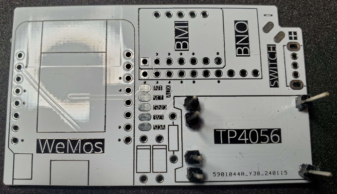

1. Break the header into individual pins.
2. Place individual pins into the through-holes.
3. Place the TP4056 on top of the header pins to sandwich them in place.
4. If needed, use a clamp, like a wooden clothespin, to hold everything in place.
5. Solder the pins to the back of the PCB.
6. Remove the TP4056 from the PCB and header pins.
7. Using a plier, carefully remove the black plastic spacer from the header pins.
8. Replace the TP4056 back through the Header pins.
9. Solder the header pins and top side of the TP4056.
10. Trim the excess length of pins using a flush cutter on the back side of the PCB and the top side of the TP4056. Use your wire cutter if you don't have a flush cutter, and cut as close to the PCB as you can.

#### IMU (BMI160, BMI270, or BNO085)

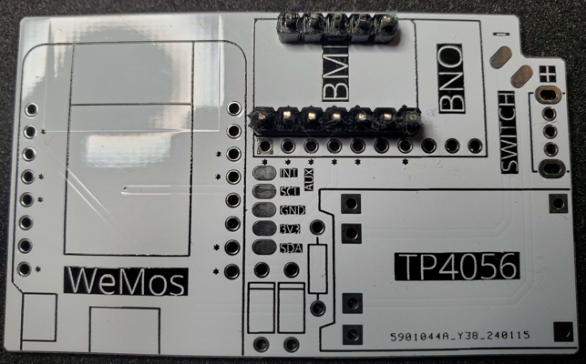

1. If using SlimeVR's BNO085, Meia's BMI270, or another IMU that does not come with header pins, break a row of header pins with the same amount of through-holes as the IMU breakout board.
2. Place the header pins in the corresponding through-holes of the PCB.
3. Solder the pins to the back of the PCB.
4. Solder the header pins and top side of the IMU.
5. Trim the excess length of pins using a flush cutter on the back side of the PCB and the top side of the IMU. Use your wire cutter if you don't have a flush cutter, and cut as close to the PCB as you can.

#### MCU (WeMos D1 Mini)

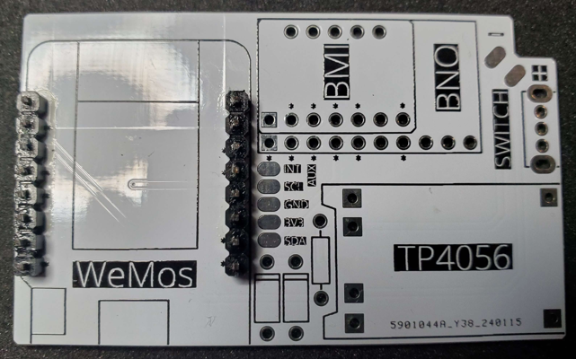

1. Flash the D1 Mini with WiFi credentials to ensure the board is in working condition first.
2. Place both rows of header pins into the through-holes of the PCB.
3. Place D1 Mini on top of the header pins to sandwich them in place.
4. If needed, use a clamp, like a wooden clothespin, to hold everything in place.
5. Solder the pins to the back of the PCB.
6. Solder the header pins and top side of the D1 Mini.
7. Trim the excess length of pins using a flush cutter on the back side of the PCB and top side of the D1 Mini. Use your wire cutter if you don't have a flush cutter, and cut as close to the PCB as you can.

#### Switch

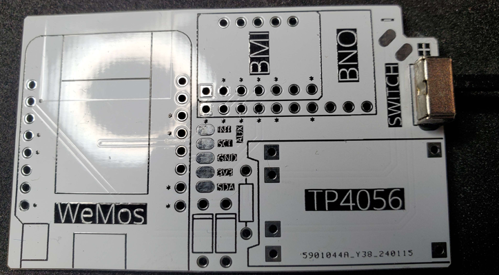

1. Place the Switch into the through-holes of the PCB.
2. Solder the 3 pins and the 2 supports on the back of the PCB.
3. Trim the excess length of pins and supports using a flush cutter on the back side of the PCB.

#### Extension Cable/Wire

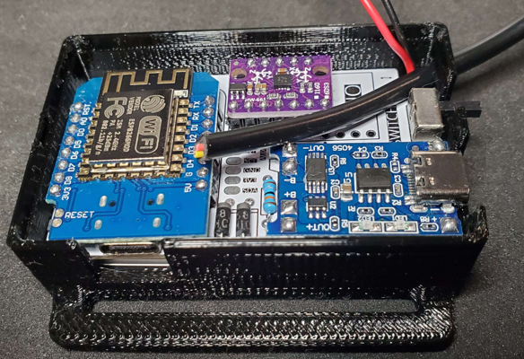

1. Put the cable or wire through the hole on your main or AUX case.
2. Take your PCB outside of the case with the wires.
3. If using a cable, cut the jacket to expose the wires inside.
4. Strip the wires to the length of the solder pads for the extensions.
5. Tin the pads by heating them up and applying solder.
6. Place the exposed copper area of the wire on the tin pads and reheat.
7. Match 3V3, GND, SDA, SCL, and INT (INT is only for BNO085) wire colors on your Main and AUX trackers.
8. Verify both trackers are working before hotgluing the outside hole of the case to ensure the cable or wire doesn't get pulled out. (This is the last step after the complete tracker is assembled.).

> [!IMPORTANT]
> Do not solder anything inside the main or AUX case! Pull the extension cable or wire outside of the case with the board before soldering.

#### Battery

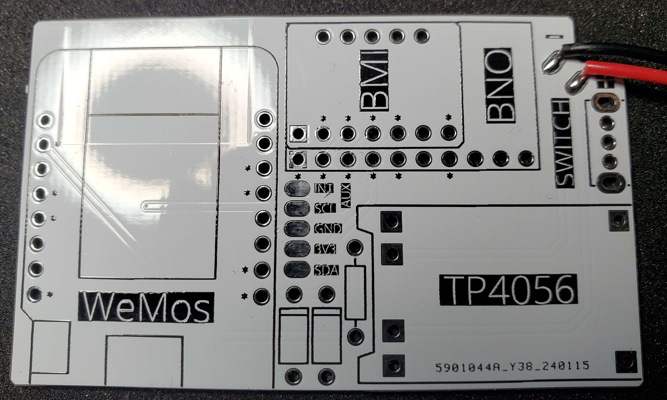

1. Strip the wires to the length of the solder pads for the battery.
2. Tin the pads by heating them up and applying solder.
3. Place the exposed copper area of the wire on the tin pads and reheat.
4. Match the Red wire with the + side and the Black wire with the - side.

> [!WARNING]
> Do not let the exposed battery leads make contact with each other.

> [!IMPORTANT]
> To prevent shorting the PCB or other components, this is the last step in completing the assembly of your tracker. (Right before hotgluing the extension cable or wire to the outside hole of the cases.)

## 3D Printable Case and Accessories Guide
The main case consists of 3 files: Case, Lid, and Tray.

Printer Settings used:
- **Printer:** Creality CR-10 S5
- **Infill:** 0%
- **No** Rafts or Supports
- **Resolution:** 0.2mm
- **Nozzle:** 0.4mm
- Tested with PLA+ and PETG

> [!TIP]
> For stronger strap loops, print the base/bottom 4mm layers with 0% (solid) infill for just the **case** file. Printing with a zig-zap pattern instead of a line will help prevent strap loops from breaking at the weak point where layers join horizontally or vertically. These are done in your Slicer.

### Case

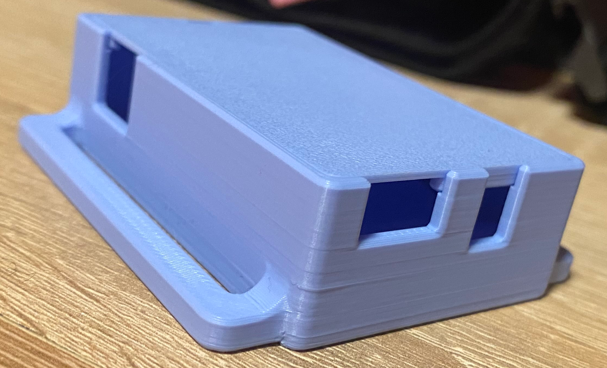

Case photo by Meia (Higanbana)

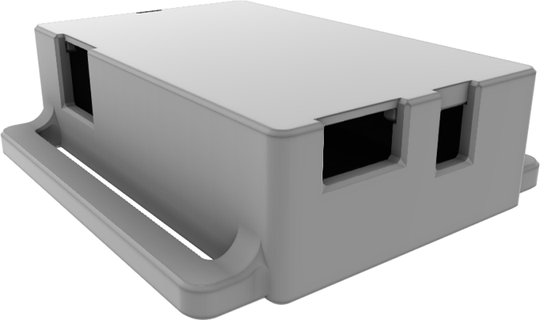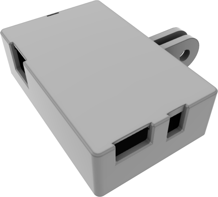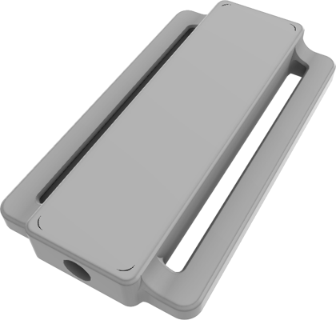

| Battery | Case Type | Variant | AUX Cutout | STL | STEP |
| -------------------- | --------------- | --------------- | --- | -------------------------------------------------------------------------------- | -------------------------------------------------------------------------------- |
| 503759 | Main | 50mm Strap | No | [CASE_meowCarrier_503759_Straps.stl](https://github.com/Shine-Bright-Meow/meowCarrier/raw/main/Printables/STL/CASE_meowCarrier_503759_Straps.stl) | [CASE_meowCarrier_503759_Straps.step](https://github.com/Shine-Bright-Meow/meowCarrier/raw/main/Printables/STEP/CASE_meowCarrier_503759_Straps.step) |
| 503759 | Main | 50mm Strap | Yes | [CASE_meowCarrier_503759_Straps_AUX.stl](https://github.com/Shine-Bright-Meow/meowCarrier/raw/main/Printables/STL/CASE_meowCarrier_503759_Straps_AUX.stl) | [CASE_meowCarrier_503759_Straps_AUX.step](https://github.com/Shine-Bright-Meow/meowCarrier/raw/main/Printables/STEP/CASE_meowCarrier_503759_Straps_AUX.step) |
| 503759 | Main | GoPro Adapter1 | No | [CASE_meowCarrier_503759_GoPro.stl](https://github.com/Shine-Bright-Meow/meowCarrier/raw/main/Printables/STL/CASE_meowCarrier_503759_GoPro.stl) | [CASE_meowCarrier_503759_GoPro.step](https://github.com/Shine-Bright-Meow/meowCarrier/raw/main/Printables/STEP/CASE_meowCarrier_503759_GoPro.step) |
| 503759 | Main | GoPro Adapter1 | Yes | [CASE_meowCarrier_503759_GoPro_AUX.stl](https://github.com/Shine-Bright-Meow/meowCarrier/raw/main/Printables/STL/CASE_meowCarrier_503759_GoPro_AUX.stl) | [CASE_meowCarrier_503759_GoPro_AUX.step](https://github.com/Shine-Bright-Meow/meowCarrier/raw/main/Printables/STEP/CASE_meowCarrier_503759_GoPro_AUX.step) |
| 503759 | Main | GoPro Adapter2 | No | [CASE_meowCarrier_503759_GoPro2.stl](https://github.com/Shine-Bright-Meow/meowCarrier/raw/main/Printables/STL/CASE_meowCarrier_503759_GoPro2.stl) | [CASE_meowCarrier_503759_GoPro2.step](https://github.com/Shine-Bright-Meow/meowCarrier/raw/main/Printables/STEP/CASE_meowCarrier_503759_GoPro2.step) |
| 503759 | Main | GoPro Adapter2 | Yes | [CASE_meowCarrier_503759_GoPro2_AUX.stl](https://github.com/Shine-Bright-Meow/meowCarrier/raw/main/Printables/STL/CASE_meowCarrier_503759_GoPro2_AUX.stl) | [CASE_meowCarrier_503759_GoPro2_AUX.step](https://github.com/Shine-Bright-Meow/meowCarrier/raw/main/Printables/STEP/CASE_meowCarrier_503759_GoPro2_AUX.step) |
| N/A | AUX | BMI Breakout Board | Yes | [CASE_meowCarrier_AUX_BMI.stl](https://github.com/Shine-Bright-Meow/meowCarrier/raw/main/Printables/STL/CASE_meowCarrier_AUX_BMI.stl) | [CASE_meowCarrier_AUX_BMI.step](https://github.com/Shine-Bright-Meow/meowCarrier/raw/main/Printables/STEP/CASE_meowCarrier_AUX_BMI.step) |
| N/A | AUX | BNO Breakout Board | Yes | [CASE_meowCarrier_AUX_BNO.stl](https://github.com/Shine-Bright-Meow/meowCarrier/raw/main/Printables/STL/CASE_meowCarrier_AUX_BNO.stl) | [CASE_meowCarrier_AUX_BNO.step](https://github.com/Shine-Bright-Meow/meowCarrier/raw/main/Printables/STEP/CASE_meowCarrier_AUX_BNO.step) |

> [!IMPORTANT]
> Print the Main Case with GoPro Adapter1 for the normal GoPro Chest Harness (Buckle).

> [!IMPORTANT]
> Print Main Case with GoPro Adapter2 for the "Chesty" GoPro Chest Harness or for the GoPro Headstrap (vTubing and Motion Capture).

> [!IMPORTANT]
> GoPro Chest Harness Tracker will have a different IMU rotation than your other trackers.

### Lid
  
| Battery | Case Type | STL | STEP |
| -------------------- | --------------- | -------------------------------------------------------------------------------- | -------------------------------------------------------------------------------- |
| 503759 | Main | [LID_meowCarrier_503759.stl](https://github.com/Shine-Bright-Meow/meowCarrier/raw/main/Printables/STL/LID_meowCarrier_503759.stl) | [LID_meowCarrier_503759.step](https://github.com/Shine-Bright-Meow/meowCarrier/raw/main/Printables/STEP/LID_meowCarrier_503759.step) |
| N/A | AUX | [LID_meowCarrier_AUX.stl](https://github.com/Shine-Bright-Meow/meowCarrier/raw/main/Printables/STL/LID_meowCarrier_AUX.stl) | [LID_meowCarrier_AUX.step](https://github.com/Shine-Bright-Meow/meowCarrier/raw/main/Printables/STEP/LID_meowCarrier_AUX.step) |

### Tray
  
| Battery | Case Type | STL | STEP |
| -------------------- | --------------- | -------------------------------------------------------------------------------- | -------------------------------------------------------------------------------- |
| 503759 | Main | [TRAY_meowCarrier_503759.stl](https://github.com/Shine-Bright-Meow/meowCarrier/raw/main/Printables/STL/TRAY_meowCarrier_503759.stl) | [TRAY_meowCarrier_503759.step](https://github.com/Shine-Bright-Meow/meowCarrier/raw/main/Printables/STEP/TRAY_meowCarrier_503759.step) |

### Accessories

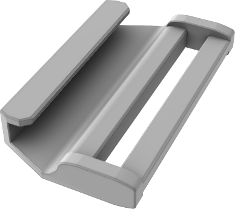
 
| Item Name | Variant | STL | STEP |
| -------------------- | --------------- | -------------------------------------------------------------------------------- | -------------------------------------------------------------------------------- |
| Quick Release Latch | 25mm Straps | [Quick_Release_Latch_25mm.stl](https://github.com/Shine-Bright-Meow/meowCarrier/raw/main/Printables/STL/Quick_Release_Latch_25mm.stl) | [Quick_Release_Latch_25mm.step](https://github.com/Shine-Bright-Meow/meowCarrier/raw/main/Printables/STEP/Quick_Release_Latch_25mm.step) |
| Quick Release Latch | 38-40mm Straps | [Quick_Release_Latch_38mm.stl](https://github.com/Shine-Bright-Meow/meowCarrier/raw/main/Printables/STL/Quick_Release_Latch_38mm.stl) | [Quick_Release_Latch_38mm.step](https://github.com/Shine-Bright-Meow/meowCarrier/raw/main/Printables/STEP/Quick_Release_Latch_38mm.step) |
| Quick Release Latch | 50mm Straps | [Quick_Release_Latch_50mm.stl](https://github.com/Shine-Bright-Meow/meowCarrier/raw/main/Printables/STL/Quick_Release_Latch_50mm.stl) | [Quick_Release_Latch_50mm.step](https://github.com/Shine-Bright-Meow/meowCarrier/raw/main/Printables/STEP/Quick_Release_Latch_50mm.step) |

## Troubleshooting
Join the [SlimeVR Discord](https://discord.gg/SlimeVR) and ask in either the #technical-support or #DIY channels. It would be helpful for you to provide a description of your issue, photos of your soldering (front and back), and a log output from Settings > Serial Console with your tracker plugged into your computer via a data USB cable into your WeMos D1 Port (non-charging). You will need to press the **Reboot** button to get the complete log.

## Contribute
Feel free to create a pull request to this repository or mention me in SlimeVR's Discord #DIY channel (do not DM me; it will go to my Message Request and I will not reply to you there) for improvement ideas or your modifications of the source files below or to the guide above.

### Source Files
| Component | Link |
| -------------------- | -------------------------------------------------------------------------------- |
| Case and Quick Release Latch | Fusion 360 Files - [meowCarrier.f3d](https://github.com/Shine-Bright-Meow/meowCarrier/raw/main/Printables/Fusion360/meowCarrier.f3d) |

## Credit
| Contributor | Description | Link |
| ------------------------- | -------------------------------------------------------------------------------- | ------------------------------------------------------------ |
| Shine Bright | PCB and Case Design, Quick Release Latch for Straps, and this guide write-up in this repository | <https://github.com/Shine-Bright-Meow/meowCarrier> |
| Meia | Marble Blue Case Photo | <https://github.com/kounocom> |

## Licence
This project is licensed under the MIT license.
